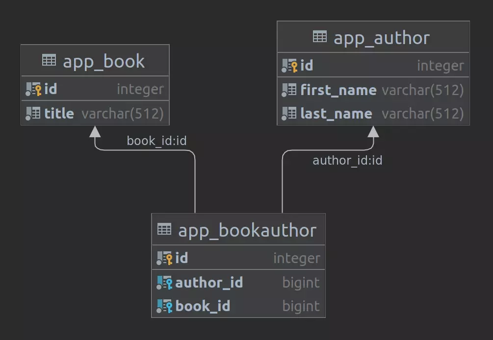

# Typical questions on tech interviews
###### If you are reading this, then you know I know the answers :D
I may also use this as a reference / reminder when working because human memory isn't perfect

___

<br/>

## Python basics
[Glossary](https://docs.python.org/3/glossary.html)

<br/>

> #### `>>>` Variable types `<<<`

Immutable (have to be re-written entirely):
* [Booleans](https://www.w3schools.com/python/python_booleans.asp) `False`: `None`, `int(0)`, `str("")`, `tuple(())`, `list([])`, `dict({})`.
* [Numbers](https://www.w3schools.com/python/python_numbers.asp) `int, float, complex` 
* [Strings](https://www.w3schools.com/python/python_strings.asp) single: `''`/`""`, multi: `''' ''''`, formatting: `"" + str(var)`, `f"{var}"`, `"{1}" t.format(var)`.
* [Tuples](https://www.w3schools.com/python/python_tuples.asp) `()` Collection, ordered, unchangeable. Allows duplicates.

Mutable (can be changed):
* [List](https://www.w3schools.com/python/python_lists.asp) `[]` Collection, ordered, changeable. Allows duplicates.
* [Dictionaries](https://www.w3schools.com/python/python_dictionaries.asp) `{"key": "value"}` Collection, ordered (from 3.7), changeable. No duplicates.
* [Sets](https://www.w3schools.com/python/python_sets.asp) `{}` Collection, unordered, unchangeable (can add/remove), unindexed. No duplicates.

The `index()` method returns the position at the first occurrence of the specified value.

<br/>

> #### `>>>` Iteration / Generation `<<<`

An [iterator](https://www.w3schools.com/python/python_iterators.asp) is an object that can be iterated upon and contains a countable number of values.  
Technically, in Python, an iterator is an object which implements the iterator protocol, which consist of the methods `__iter__()` and `__next__()`.

[Generators](https://realpython.com/introduction-to-python-generators/) don't store data in memory, instead they return the answer only when called.  
Generator functions use `yield()` instead of `return()`, also `throw()` for errors and `close()` to finish.
On `yield()` statement, function execution is suspended yielded value returns to the caller but that doesn't stop the function.  
Using generators on mutable objects saves memory.  

<br/>

> #### `>>>` Lambda functions `<<<`

##### [lambda](https://www.w3schools.com/python/python_lambda.asp) arguments : expression

Simple usage: `lambda a, b : a + b`

Advanced usage:
```py
def multiply_by(n):
  return lambda a : a * n

multiply_by_two = multiply_by(2)

print(multiply_by_two(11))
```

<br/>

> #### `>>>` Decorators `<<<`

A [decorator](https://realpython.com/primer-on-python-decorators/) is a function that takes another function and extends the behavior of the latter function without explicitly modifying it.

```py
def decorator(func):
    def wrapper():
        # action 1
        function()
        # action 3
    return wrapper

@decorator
def function():
    # action 2
```
calling `function` actually returns `wrapper` of `decorator`.

<br/>

> #### `>>>` Classes `<<<`

A [class](https://docs.python.org/3/tutorial/classes.html) is a user-defined blueprint or prototype from which objects are created.  
Additional info on [class and static methods](https://realpython.com/instance-class-and-static-methods-demystified/).

```py
class Example:
    class_car = 1           # class variables belong to all instances of that class
    _protected_var = 1      # not hidden but should be only used internally
    __private_var = 1       # private, is hidden and protected from subclasses
    # same underscore rules apply to methods

    def instance_method(self):  # instance method
        self.x = 1              # instance variable (shuold be declared in a function)
        return self.x

    @classmethod            # only has access to class variables
    def class_method(cls):  # can be used to change the entire class and all subsequent instances
        return cls.x

    @staticmethod           # static methods can't access neither class, nor instance variables
    def static_method():    # they are primarily used for namespacing
        return 'static method'
```

Built in functions (not all, just the most used ones):  
* `__init__(self, [,args...])` is is called when a new class object is created.
* `__dict__(self)` returns a dictionary containing the class's namespace.
* `__bases__(self)` returns base classes.
* `__del__(self)` deletes the instance from memory.
* `__str__(self)` gives a user-friendly representation.
* `__repr__(self)` gives a developer-friendly representation.
* `__cmp__(self, x)` compares instance to another object.

<br/>

> #### `>>>` Asynchronicity `<<<`

**Concurrency** means executing multiple tasks at the same time but not necessarily simultaneously.  
**Parallelism** means executing multiple tasks at the same time simultaneously. Can only be achieved with multiple cores.

**Threads** run in the same memory space, while **processes** have separate memory.

**Global Interpreter Lock** (GIL) makes sure there is, at any time, only one **thread** is running.  
That ensures **thread-safety** and prevents threads from **racing** to make changes to memory.

To achieve **parallelism** Python has `multiprocessing` module which is not affected by the GIL.
___

<br/>

## Django

> #### `>>>` Models `<<<`

Many-to-many relation in DB:



<br/>

> #### `>>>` Object related mapping (ORM) and QuerySets `<<<`

A [QuerySet](https://docs.djangoproject.com/en/dev/ref/models/querysets/) can be constructed, filtered, sliced, and generally passed around without actually hitting the database. No database activity actually occurs until you do something to evaluate the queryset.

* `.aggregate()` calculates values for the entire queryset.  
```py
Book.objects.aggregate(average_price=Avg('price'))
# {'average_price': 34.35}
```

* `.annotate()` calculates summary values for each item in the queryset.  
```py
q = Book.objects.annotate(num_authors=Count('authors'))
q[0].num_authors
# 2
```

* `.select_related(*fields)` works by creating an SQL join and including the fields of the related object in the SELECT statement.  
For this reason, it gets the related objects in the same database query. However, it is limited to single-valued relationships - foreign key and one-to-one.
```python
Entry.objects.select_related('blog').get(id=5)
blog = e.blog   # doesn't perform additional database request
```

* `.prefetch_related(*lookups)` does a separate lookup for each relationship, and does the ‘joining’ in Python. This allows it to prefetch many-to-many and many-to-one objects.
___

<br/>

> #### `>>>` Databases `<<<`

`Relational databases` model data as records in rows and tables with logical links between them.

`SQL` (*Structured Query Language*) is the programming language used to interface with **relational databases**.

`NoSQL` is a class of DBMs (*Database Management Systems*) that are non-relational and generally do not use SQL, they often use **json-like** structure.

**SQL databases** are vertically scalable, they are slower to fill because of **indexing** but are more reliable and secure.  
**NoSQL databases** are horizontally scalable, slower to retrieve because are **not indexed**.
___

<br/>

> #### `>>>` Caching `<<<`

Caching systems typically are in-memory NoSQL data storages, keeping data as key value pairs.  
Both memcached and redis support multithreading.

`Memcached`  

- Stores data in strings only. Doesn't allow replication *natively*.
- Doesn't have built in **data persistance** mechanism.
- Supports a key of only 250 bytes and values are capped at 1MB *by default*.
- Evicts data by *Least Recently Used*.

`Redis`  

- Stores data in [different data types](https://redis.io/docs/manual/data-types/). That allows data replication without having to re-upload the entire data value.
- Has *optional* [data persistance](https://redis.io/docs/manual/persistence/) mechanism to preserve data between shutdowns.
  - That is achieved through AOF (Append Only File) logging of all write operations or backup snapshot.
- Data keys and strings can be up to 512 MB in length.
- Has several options for [data eviction](https://docs.redis.com/latest/rs/databases/configure/eviction-policy/).
- Scaling is possible through clusters (Jedis and Redisson) connected over TCP protocol.

`Tarantula` ...
___

<br/>

> #### `>>>` Background tasks `<<<`

**Queue** - a queue of tasks (functions) waiting for the broker to assign.  
A separate service called a **message broker** - a solution to send and receive messages (Redis, RabbitMQ).  
**Workers** are processes that receive tasks from the broker and execute them. 

`Redis queue`  
- Simple API and easy documentation.
- Only works with python.
- Only works with Redis, no other brokers. In case of Redis, it doesn't guarantee data safety.
- Runs only on Linux.

`Celery`  
- Broker support allows to exchange tasks with other instances / programs.
- Runs on any OS.
- Complex yet flexible API, alot of options.
- Allows creating subtasks (?)
___

<br/>

[//]: # (### Hosting)
[//]: # (`Nginx`  )
[//]: # (`Gunicorn`  )
[//]: # (`Docker`  )
[//]: # (`AWS`)

[//]: # (### APIs)
[//]: # (`REST`  )
[//]: # (`SOAP`  )
[//]: # (`RPC`  )

[//]: # (### Git)
[//]: # (`Overview`  )
[//]: # (`Git flow`  )
[//]: # (`Typical operations`  )

[//]: # (### Network)
[//]: # (`HTTP / HTTPS`  )
[//]: # (`TCP / UDP`  )
